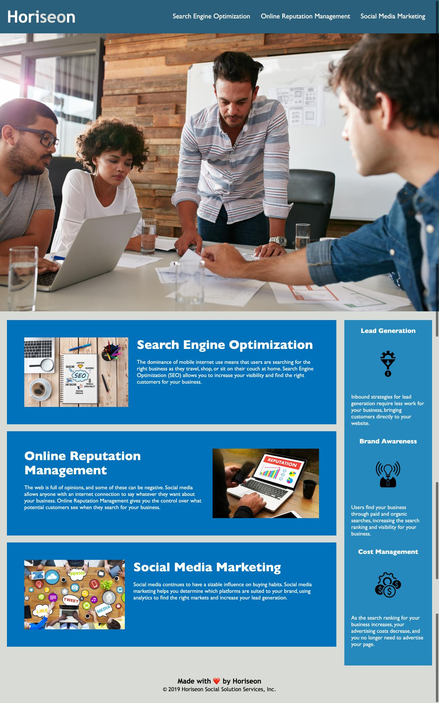

# Horiseon-Code-Refactor

The Horiseon website was built in a way that didnt follow the standard for the Americans with Disabilities Act that requires business to make accomidations for people with disabilities.
I refactored the application code to meet all of the requirements without changing the appearence of the website itself.

I reworked the HTML to include semantic HTML elements and that follow of logical structure independent of styling and positioning. I changed the title element to a more descriptive title. Made sure the heading attributes are in sequential order. I also added accesable alt attributes to all of the images and made sure all of the applications links work correctly.
For the CSS, I consolidated all of the selectors and properties and made them follow the semantic structure of the HTML. I left comments on both the HTML and CSS pages to show all of the work that I had done.

all files have been uploaded to the github repository(see link below) and the application has been deployed to a live url using github pages (see link below)
The application should load with no issues or errors.

[github pages site] https://jbarbss.github.io/Horiseon-Code-Refactor/

[github repo site] https://github.com/Jbarbss/Horiseon-Code-Refactor
